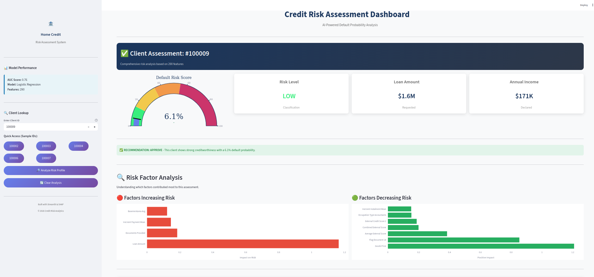
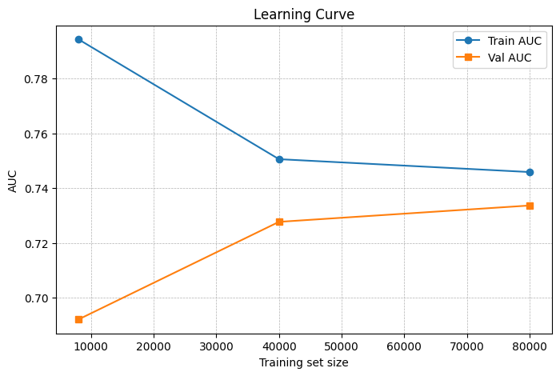

# 🏦 Credit Risk Scoring System

<div align="center">


**An end-to-end machine learning solution for predicting loan default probability**

[Features](#-key-features) • [Results](#-model-performance) • [Installation](#-installation) • [Usage](#-usage) • [Dashboard](#-interactive-dashboard)

</div>

---
## 🖥️ Interactive Dashboard


## 📋 Executive Summary

This project delivers a **production-ready credit scoring system** that predicts the probability of loan default using machine learning. Built on the Home Credit Default Risk dataset (307,511 applications), the system achieves an **AUC of 0.76**, significantly exceeding the target of 0.62.

### Business Value
- 🎯 **Risk Assessment**: Automated credit risk evaluation in milliseconds
- 📊 **Explainability**: SHAP-based explanations for regulatory compliance
- 🖥️ **Interactive Dashboard**: User-friendly interface for credit analysts
- 📈 **Scalable**: Handles 300K+ applications efficiently

---

## 🎯 Key Features

| Feature | Description |
|---------|-------------|
| **Predictive Model** | Logistic Regression with 290 engineered features |
| **Feature Engineering** | Domain-specific ratios (Debt-to-Income, Payment-to-Income, etc.) |
| **Model Interpretability** | SHAP force plots and feature importance analysis |
| **Interactive Dashboard** | Streamlit app with real-time risk assessment |
| **Cross-Validation** | 5-fold stratified CV with AUC 0.7521 ± 0.0047 |

---

## 📈 Model Performance

### Results Summary

| Metric | Value | Target | Status |
|--------|-------|--------|--------|
| **Test AUC** | 0.76 | 0.62 | ✅ Exceeded |
| **CV AUC** | 0.7521 | 0.55 | ✅ Exceeded |
| **CV Std Dev** | 0.0047 | - | Low variance |
| **Features** | 290 | - | Engineered |
| **Training Samples** | 307,511 | - | Full dataset |

### Learning Curve

The model shows excellent generalization with minimal overfitting:



---

## 🛠️ Technical Architecture

```
┌─────────────────────────────────────────────────────────────────┐
│                     DATA PIPELINE                                │
├─────────────────────────────────────────────────────────────────┤
│  Raw Data (7 tables)  →  Feature Engineering  →  Model Training │
│                                                                  │
│  • application_train.csv     • Domain-specific ratios           │
│  • bureau.csv               • External score combinations        │
│  • previous_application.csv  • Aggregated auxiliary features    │
│  • installments_payments.csv                                     │
│  • credit_card_balance.csv                                       │
│  • POS_CASH_balance.csv                                          │
└─────────────────────────────────────────────────────────────────┘
                              ↓
┌─────────────────────────────────────────────────────────────────┐
│                     ML MODEL                                     │
├─────────────────────────────────────────────────────────────────┤
│  StandardScaler  →  Logistic Regression (L2 regularization)     │
│                                                                  │
│  • class_weight='balanced' for imbalanced data (8% default)    │
│  • C=0.1 regularization strength                                │
│  • 5-fold stratified cross-validation                           │
└─────────────────────────────────────────────────────────────────┘
                              ↓
┌─────────────────────────────────────────────────────────────────┐
│                     INTERPRETABILITY                             │
├─────────────────────────────────────────────────────────────────┤
│  SHAP LinearExplainer  →  Force Plots  →  Feature Importance    │
│                                                                  │
│  • Global: Which features matter most overall?                  │
│  • Local: Why did this specific client get this score?          │
└─────────────────────────────────────────────────────────────────┘
```

---

## 🔧 Engineered Features

Key domain-specific features that improved model performance:

| Feature | Formula | Business Meaning |
|---------|---------|------------------|
| `CREDIT_INCOME_RATIO` | Loan / Income | Debt burden indicator |
| `ANNUITY_INCOME_RATIO` | Monthly Payment / Income | Payment affordability |
| `CREDIT_GOODS_RATIO` | Loan / Goods Price | Loan coverage ratio |
| `EXT_SOURCE_MEAN` | Mean(External Scores) | Combined credit bureau score |
| `INCOME_PER_FAMILY` | Income / Family Size | Per-capita income |
| `EMPLOYED_TO_AGE_RATIO` | Employment / Age | Career stability |

---

## 💻 Installation

### Prerequisites
- Python 3.9+
- pip package manager

### Setup

```bash
# Clone the repository
git clone https://github.com/yourusername/credit-scoring.git
cd credit-scoring

# Install dependencies
pip install -r requirements.txt
```

---

## 🚀 Usage

### Quick Start (Full Pipeline)

```bash
# Run everything in one command
./run_pipeline.sh
```

### Step-by-Step

```bash
# 1. Feature Engineering
python3 scripts/preprocess.py

# 2. Train Model
python3 scripts/train.py

# 3. Evaluate on Test Set
python3 scripts/predict.py

# 4. Generate Explainability Reports
python3 scripts/explain.py

# 5. Launch Dashboard
streamlit run results/dashboard/dashboard.py
```

---

## 🖥️ Interactive Dashboard

The Streamlit dashboard provides:

- **Risk Score Gauge**: Visual probability of default
- **SHAP Analysis**: Factors increasing/decreasing risk
- **Client Comparison**: How client compares to population
- **Decision Support**: Approve/Review/Decline recommendations

### Launch Dashboard
```bash
streamlit run results/dashboard/dashboard.py
```

---

## 📁 Project Structure

```
credit-scoring/
│
├── 📊 data/                          # Dataset files
│   ├── application_train.csv         # Training data (307K rows)
│   ├── application_test.csv          # Test data (48K rows)
│   ├── application_train_features.csv # Engineered features
│   └── ...                           # Auxiliary tables
│
├── 📈 results/
│   ├── model/
│   │   ├── baseline_logreg.joblib    # Trained model
│   │   ├── learning_curve.png        # Training visualization
│   │   └── model_report.txt          # Detailed methodology
│   │
│   ├── feature_engineering/
│   │   └── EDA.ipynb                 # Exploratory analysis
│   │
│   ├── clients_outputs/
│   │   ├── client_correct_train_*.png # Correctly predicted client
│   │   ├── client_wrong_train_*.png   # Misclassified client analysis
│   │   ├── client_test_*.png          # Test set client
│   │   └── wrong_prediction_analysis.txt # Error analysis
│   │
│   └── dashboard/
│       └── dashboard.py              # Streamlit application
│
├── 📜 scripts/
│   ├── preprocess.py                 # Feature engineering pipeline
│   ├── train.py                      # Model training
│   ├── predict.py                    # Inference & evaluation
│   └── explain.py                    # SHAP analysis
│
├── requirements.txt                  # Dependencies
├── run_pipeline.sh                   # Full pipeline script
└── README.md                         # This file
```

---

## 📊 Model Interpretability

### Client Analysis Examples

The system analyzes three types of clients:

1. **Correct Prediction** (Train): Model correctly identified a defaulter
2. **Wrong Prediction** (Train): Model missed a defaulter → Root cause analysis
3. **Test Client**: Prediction on unseen data with full explanation

### Sample Wrong Prediction Analysis

```
ERROR TYPE: FALSE NEGATIVE (Missed a defaulter)
This is a DANGEROUS error - the model approved a risky client.

FACTORS THAT MISLED THE MODEL:
  • External Score 1: Client had unusually high score
  • Employment Duration: Stable employment history
  • Property indicators: Appeared financially stable

CONCLUSION: The model relies heavily on external scores which can
miss clients with hidden risk factors. Tree-based models may
capture such non-linear patterns better.
```

---

## 🔬 Methodology

### Why Not Accuracy?

The dataset is **highly imbalanced** (8% default rate). A naive model predicting "no default" for everyone would achieve 92% accuracy but be useless.

Instead, we use **ROC-AUC** which measures the model's ability to distinguish between classes regardless of threshold.

### Overfitting Prevention

1. **L2 Regularization**: Built into Logistic Regression
2. **Class Weighting**: Balanced weights for minority class
3. **Cross-Validation**: 5-fold stratified CV
4. **Learning Curves**: Monitored train/val gap

---

## 🚧 Future Improvements

1. **LightGBM/XGBoost**: Could achieve AUC > 0.78
2. **More Feature Engineering**: Payment delay patterns, bureau aggregations
3. **Ensemble Methods**: Combine multiple models
4. **Hyperparameter Tuning**: Bayesian optimization
5. **Real-time API**: Flask/FastAPI deployment

---

## 👤 Author

**Amir Iqbal**

---

## 📄 License

This project is for educational and demonstration purposes.

---

<div align="center">
<strong>Built with ❤️ for Credit Risk Analytics</strong>
</div>

